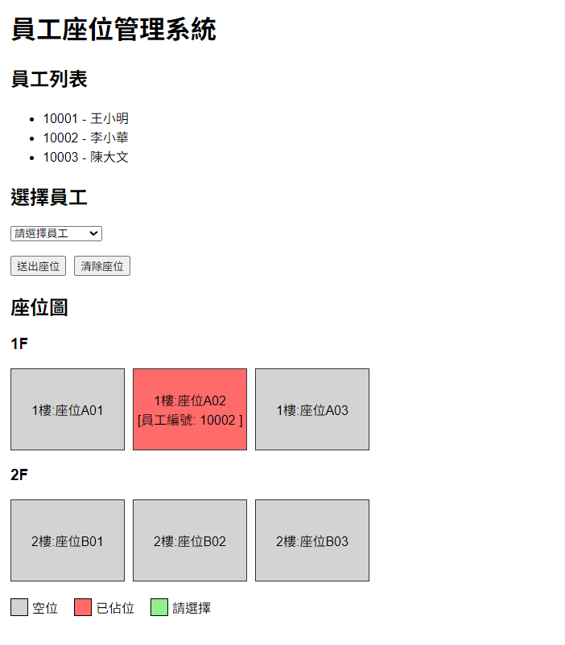
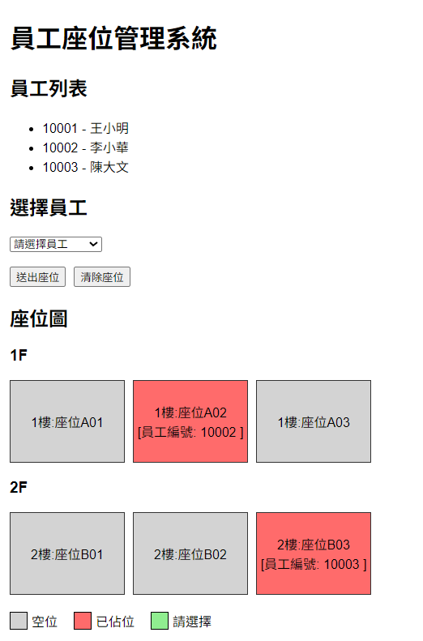
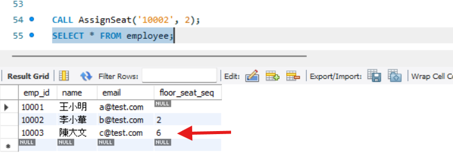

# 員工座位管理系統 (Employee Seat System)

## 系統畫面

### 座位管理畫面

---

## 專案簡介

本系統為人資部門使用之員工座位管理系統，可進行座位查詢、座位指派與座位清除等功能。

---

## 使用技術

### Frontend

* Vue 3
* Axios
* Vite

### Backend

* Spring Boot
* Spring Data JPA
* Maven

### Database

* MySQL 8.x

---

## 系統功能

1. 顯示樓層座位
2. 員工座位指派
3. 清除座位
4. 顯示座位狀態
5. 顯示已佔用座位員工編號

---

## 資料庫設計

資料表：

* Employee
* SeatingChart

資料庫腳本請參考：

* DB/ddl.sql
* DB/dml.sql
* DB/sp.sql

---

## Stored Procedure

Stored Procedure：

AssignSeat

用途：

* 指派員工座位
* 更新 Employee 資料表中的 FLOOR_SEAT_SEQ

範例：

CALL AssignSeat('10002',2);

系統透過 Spring Boot Repository 呼叫 Stored Procedure 完成座位指派功能。
### Stored Procedure 測試

---

## 安全性設計

### SQL Injection 防護

本系統使用 Spring Data JPA 存取資料庫，透過 Parameter Binding 避免 SQL Injection 攻擊。

### XSS 防護

前端使用 Vue Template Syntax（{{ }}），Vue 會自動進行 HTML Escape，降低 XSS 風險。

---

## 執行方式

### 資料庫

Database：
employee_seat_system

Port：
3306

如需於其他環境執行，請修改：

backend/src/main/resources/application.properties

中的資料庫連線設定。

### 啟動順序

1. 啟動 MySQL
2. 啟動 Spring Boot
3. 啟動 Vue

Frontend：
http://localhost:5173

Backend API：
http://localhost:8080

---

## 系統架構

Frontend（Vue 3）

↓

Backend（Spring Boot）

↓

Database（MySQL）

